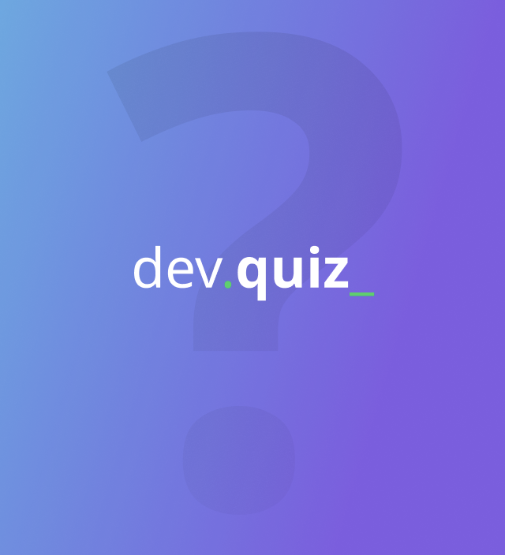

# DevQuiz Flutter

<!-- BADGES -->
<p align="center">
  
  
  
  
  
  <a href="https://www.linkedin.com/in/abilioazevedo/">
    
  </a>
</p>
<br/>

<!-- PROJECT LOGO -->
<p align="center">
  <a href="https://github.com/kibolho/devquiz-flutter">
     
  </a>
</p>

***

<!-- TABLE OF CONTENTS -->
# Table of Contents
- [DevQuiz Flutter](#devquiz-flutter)
- [Table of Contents](#table-of-contents)
- [:boom: About The Project](#boom-about-the-project)
- [:gear: Built With](#gear-built-with)
  - [Tools](#tools)
  - [Technologies](#technologies)
- [:rocket: Getting Started](#rocket-getting-started)
  - [:zap: To RUN](#zap-to-run)
- [Final Result](#final-result)
- [:bulb: Contributing](#bulb-contributing)
- [:memo: License](#memo-license)
- [:e-mail: Contact](#e-mail-contact)
- [:exclamation: Acknowledgements](#exclamation-acknowledgements)
<!-- * [Usage](#usage)
* [Roadmap](#arrows_clockwise-roadmap) -->

<!-- ABOUT THE PROJECT -->
# :boom: About The Project


[Steps of Development](https://www.notion.so/Trilha-Flutter-a306b8d8751b4f76a7a1fc8f29db6d65) 🚀

[Figma Prototype](https://www.figma.com/file/fMqKhwT9L5D3MVe4btRtG5/DevQuiz)

# :gear: Built With
  ## Tools
  * [VSCode](https://code.visualstudio.com/)

  ## Technologies
  * [Flutter](https://flutter.dev/)

  [:arrow_up: Back to top](#table-of-Contents)


<!-- GETTING STARTED -->
# :rocket: Getting Started

First of all, correctly configure the Flutter development environment on your machine, see https://flutter.dev/docs/get-started/install

To get a local copy up and running follow these simple steps.


[:arrow_up: Back to top](#table-of-Contents)


## :zap: To RUN
Run the commands below to install and run the app.
  ```sh
    #Clone the project
    git clone https://github.com/kibolho/devquiz-flutter
```

Install dependencies:
```sh
  flutter pub get
```

Start the aplication and enjoy: \o/
```sh
  fluter run
```

[:arrow_up: Back to top](#table-of-Contents)


# Final Result

<p align="center">
  
</p>

<!-- CONTRIBUTING -->
# :bulb: Contributing

Any contributions you make are **greatly appreciated**.

1. Fork the Project
2. Create your Feature Branch (`git checkout -b feature`)
3. Commit your Changes (`git commit -m 'Add some Feature'`)
4. Push to the Branch (`git push origin Feature`)
5. Open a Pull Request

[:arrow_up: Back to top](#table-of-Contents)

<!-- USAGE EXAMPLES -->
<!-- # Usage

Use this space to show useful examples of how a project can be used. Additional screenshots, code examples and demos work well in this space. You may also link to more resources.

_For more examples, please refer to the [Documentation](https://example.com)_ -->


<!-- LICENSE -->
# :memo: License

Distributed under the MIT License. See [LICENSE](LICENSE.md) for more information.

[:arrow_up: Back to top](#table-of-Contents)


<!-- CONTACT -->
# :e-mail: Contact

Abílio Azevedo - <me@abilioazevedo.com.br>

LinkedIn - <https://www.linkedin.com/in/abilioazevedo/>

[:arrow_up: Back to top](#table-of-Contents)


<!-- ACKNOWLEDGEMENTS -->
# :exclamation: Acknowledgements

* [Next Level Week](http://nextlevelweek.com/)
* [Rocketseat](https://rocketseat.com.br/ "Rocketseat").
* [GabulDev](https://www.linkedin.com/in/gabuldev/)

[:arrow_up: Back to top](#table-of-Contents)


